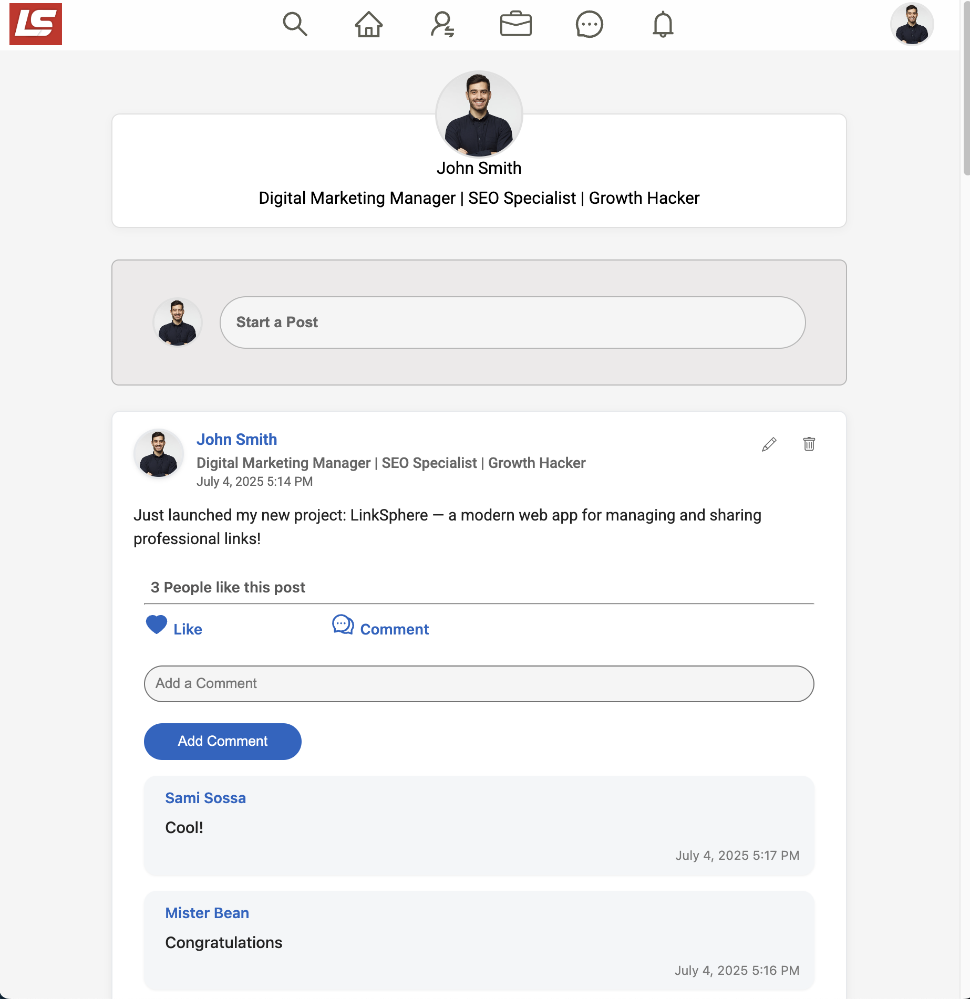

# LinkSphere

LinkSphere is a modern web application for seamless link management, sharing, and professional networking. Built with **React** and **Firebase**, it enables users to connect, share resources, and manage their professional presence online.

---

## 🚀 Demo

> **Live Demo:** (https://moshe-alper.github.io/LinkSphere/)
> 
> 

---

## ✨ Features

- **User Authentication:** Secure sign up and login with email/password and Google.
- **Profile Management:** Create and edit your professional profile.
- **Connections:** Discover and connect with other users.
- **Link Sharing:** Post and manage links in real-time.
- **Responsive UI:** Modern, mobile-friendly design using React and Ant Design.
- **Notifications:** User feedback with toasts for actions and errors.

---

## 🛠️ Technologies Used

- [React](https://reactjs.org/)
- [Firebase (Auth, Firestore, Storage)](https://firebase.google.com/)
- [Ant Design](https://ant.design/)
- [React Router](https://reactrouter.com/)
- [Sass](https://sass-lang.com/)

---

## 📂 Folder Structure

```
/LinkSphere
├── public/              # Static assets
├── src/
│   ├── api/             # API calls (Firebase, Auth, Firestore)
│   ├── assets/          # Images, logos
│   ├── cmps/            # React components
│   ├── helpers/         # Utility functions
│   ├── layouts/         # Layout components
│   ├── pages/           # Main app pages (Home, Login, Register, Profile, Connections)
│   ├── Routes/          # App routing
│   ├── Sass/            # Styles (Sass)
│   ├── firebaseConfig.js# Firebase setup
│   └── main.jsx         # App entry point
├── package.json         # Project metadata & scripts
└── ...
```

---

## 📝 Getting Started

### Prerequisites
- Node.js & npm
- A Firebase project

### Installation
```bash
git clone https://github.com/yourusername/linksphere.git
cd linksphere
npm install
```

### Firebase Configuration
1. Create a Firebase project at [Firebase Console](https://console.firebase.google.com/).
2. Copy your Firebase config and add it to `src/firebaseConfig.js` (replace the example config).

### Running the App
```bash
npm start
```

---

## 👤 Usage

1. **Register:** Create an account with email/password or Google.
2. **Login:** Sign in to access your dashboard.
3. **Edit Profile:** Update your profile details and image.
4. **Add Connections:** Browse and connect with other users.
5. **Share Links:** Post links to share with your network.

---

## 🙏 Acknowledgements

Special thanks to [@CybernaticoByNishant](https://www.youtube.com/@CybernaticoByNishant) for the excellent tutorial:  
[Build a LinkedIn Clone with React & Firebase (YouTube)](https://www.youtube.com/watch?v=HimR8Xtz17U)

This project was inspired and built based on that video. Huge thanks for sharing such a clear and helpful guide!

---

## 🤝 Contributing

Contributions are welcome! Please open issues or submit pull requests for improvements and bug fixes.

---

## 📧 Contact

For questions or support, please open an issue or contact [moshikalper@gmail.com](mailto:moshikalper@gmail.com).

---

## 📝 License

MIT
